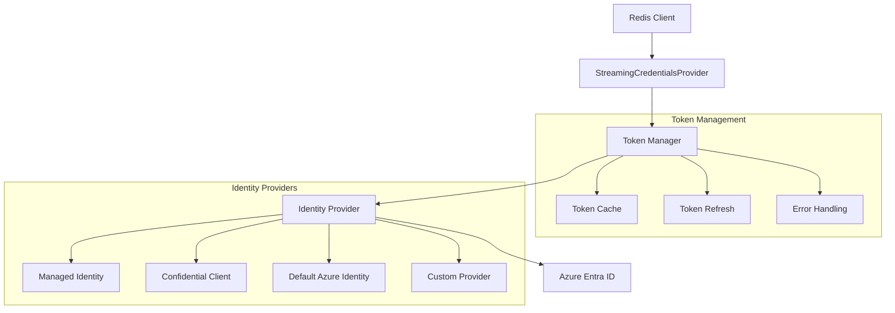
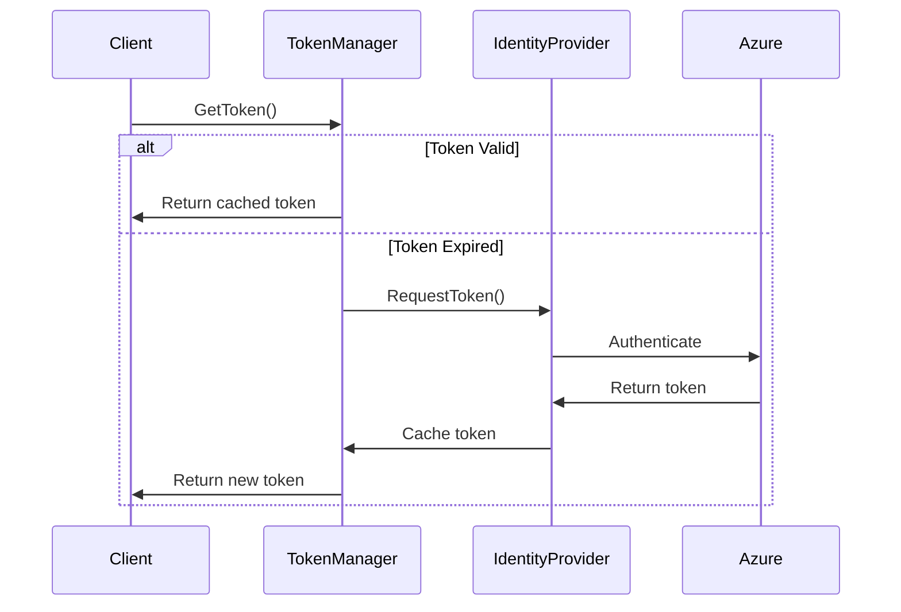
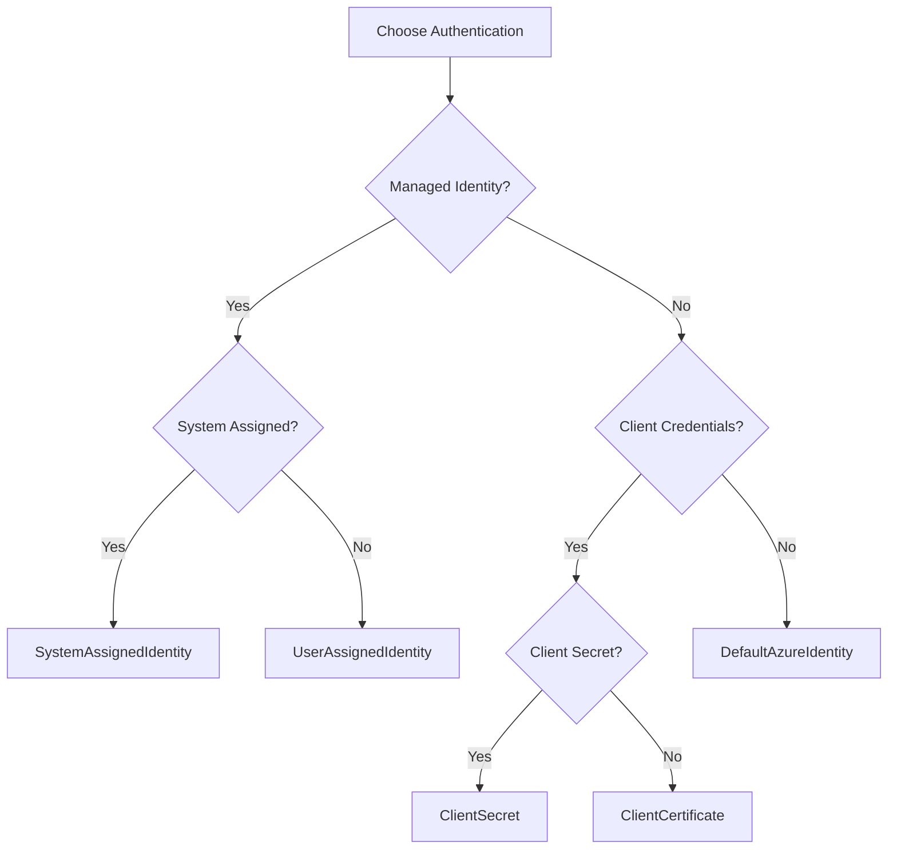

# go-redis-entraid
Entra ID extension for go-redis

## Table of Contents
- [Introduction](#introduction)
- [Quick Start](#quick-start)
- [Architecture Overview](#architecture-overview)
- [Authentication Providers](#authentication-providers)
- [Configuration Guide](#configuration-guide)
- [Examples](#examples)
- [Testing](#testing)
- [FAQ](#faq)

## Introduction

go-redis-entraid is a Go library that provides Entra ID (formerly Azure AD) authentication support for Redis Enterprise Cloud. It enables secure authentication using various Entra ID identity types and manages token lifecycle automatically.

### Version Compatibility
- Go: 1.16+
- Redis: 6.0+
- Azure Entra ID: Latest

### Key Features
- Support for multiple Entra ID identity types
- Automatic token refresh and management
- Configurable token refresh policies
- Retry mechanisms with exponential backoff
- Thread-safe token management
- Streaming credentials provider interface

## Quick Start

### Minimal Example
Here's the simplest way to get started:

```go
package main

import (
    "context"
    "fmt"
    "log"
    "os"
    "strings"

    "github.com/redis-developer/go-redis-entraid/entraid"
    "github.com/redis/go-redis/v9"
)

func main() {
    // Get required environment variables
    clientID := os.Getenv("AZURE_CLIENT_ID")
    redisEndpoint := os.Getenv("REDIS_ENDPOINT")
    if clientID == "" || redisEndpoint == "" {
        log.Fatal("AZURE_CLIENT_ID and REDIS_ENDPOINT environment variables are required")
    }

    // Create credentials provider
    provider, err := entraid.NewManagedIdentityCredentialsProvider(entraid.ManagedIdentityCredentialsProviderOptions{
        CredentialsProviderOptions: entraid.CredentialsProviderOptions{
            ClientID: clientID,
        },
    })
    if err != nil {
        log.Fatalf("Failed to create credentials provider: %v", err)
    }

    // Create Redis client
    client := redis.NewClient(&redis.Options{
        Addr: redisEndpoint,
        StreamingCredentialsProvider: provider,
    })
    defer client.Close()

    // Test connection
    ctx := context.Background()
    if err := client.Ping(ctx).Err(); err != nil {
        log.Fatalf("Failed to connect to Redis: %v", err)
    }
    log.Println("Connected to Redis!")
}
```

### Environment Setup
```bash
# Required environment variables
export AZURE_CLIENT_ID="your-client-id"
export REDIS_ENDPOINT="your-redis-endpoint:6380"

# Optional environment variables
export AZURE_TENANT_ID="your-tenant-id"
export AZURE_CLIENT_SECRET="your-client-secret"
export AZURE_AUTHORITY_HOST="https://login.microsoftonline.com"  # For custom authority
```

### Running the Example
```bash
go mod init your-app
go get github.com/redis-developer/go-redis-entraid
go run main.go
```

## Architecture Overview

### Component Diagram


### Token Lifecycle


### Component Responsibilities

1. **Redis Client**
   - Handles Redis connections
   - Manages connection pooling
   - Implements Redis protocol

2. **StreamingCredentialsProvider**
   - Provides authentication credentials
   - Handles token refresh
   - Manages authentication state

3. **Token Manager**
   - Caches tokens
   - Handles token refresh
   - Implements retry logic
   - Manages token lifecycle

4. **Identity Provider**
   - Authenticates with Azure
   - Handles different auth types
   - Manages credentials

## Authentication Providers

### Provider Selection Guide



### Provider Comparison

| Provider Type | Best For | Security | Configuration | Performance |
|--------------|----------|----------|---------------|-------------|
| System Assigned | Azure-hosted apps | Highest | Minimal | Best |
| User Assigned | Shared identity | High | Moderate | Good |
| Client Secret | Service auth | High | Moderate | Good |
| Client Cert | High security | Highest | Complex | Good |
| Default Azure | Development | Moderate | Minimal | Good |

## Configuration Guide

### Environment Variables
```bash
# Required
AZURE_CLIENT_ID=your-client-id
REDIS_ENDPOINT=your-redis-endpoint:6380

# Optional
AZURE_TENANT_ID=your-tenant-id
AZURE_CLIENT_SECRET=your-client-secret
```

### Available Configuration Options

#### 1. CredentialsProviderOptions
Base options for all credential providers:
```go
type CredentialsProviderOptions struct {
    // Required: Client ID for authentication
    ClientID string

    // Optional: Token manager configuration
    TokenManagerOptions manager.TokenManagerOptions
}
```

#### 2. TokenManagerOptions
Options for token management:
```go
type TokenManagerOptions struct {
    // Optional: Ratio of token lifetime to trigger refresh (0-1)
    // Default: 0.7 (refresh at 70% of token lifetime)
    ExpirationRefreshRatio float64

    // Optional: Minimum time before expiration to trigger refresh
    // Default: 0 (no lower bound, refresh based on ExpirationRefreshRatio)
    LowerRefreshBound time.Duration

    // Optional: Custom response parser
    IdentityProviderResponseParser shared.IdentityProviderResponseParser

    // Optional: Configuration for retry behavior
    RetryOptions RetryOptions

    // Optional: Timeout for token requests
    RequestTimeout time.Duration
}
```

#### 3. RetryOptions
Options for retry behavior:
```go
type RetryOptions struct {
    // Optional: Function to determine if an error is retryable
    // Default: Checks for network errors and timeouts
    IsRetryable func(err error) bool

    // Optional: Maximum number of retry attempts
    // Default: 3
    MaxAttempts int

    // Optional: Initial delay between retries
    // Default: 1 second
    InitialDelay time.Duration

    // Optional: Maximum delay between retries
    // Default: 10 seconds
    MaxDelay time.Duration

    // Optional: Multiplier for exponential backoff
    // Default: 2.0
    BackoffMultiplier float64
}
```

#### 4. ManagedIdentityProviderOptions
Options for managed identity authentication:
```go
type ManagedIdentityProviderOptions struct {
    // Required: Type of managed identity
    ManagedIdentityType ManagedIdentityType // SystemAssignedIdentity or UserAssignedIdentity

    // Optional: Client ID for user-assigned identity
    UserAssignedClientID string

    // Optional: Scopes for token access
    // Default: ["https://redis.azure.com/.default"]
    Scopes []string
}
```

#### 5. ConfidentialIdentityProviderOptions
Options for confidential client authentication:
```go
type ConfidentialIdentityProviderOptions struct {
    // Required: Client ID for authentication
    ClientID string

    // Required: Type of credentials
    CredentialsType string // identity.ClientSecretCredentialType or identity.ClientCertificateCredentialType

    // Required for ClientSecret: Client secret value
    ClientSecret string

    // Required for ClientCertificate: Client certificate
    // Type: []*x509.Certificate
    ClientCert []*x509.Certificate

    // Required for ClientCertificate: Client private key
    // Type: crypto.PrivateKey
    ClientPrivateKey crypto.PrivateKey

    // Required: Authority configuration
    Authority AuthorityConfiguration

    // Optional: Scopes for token access
    // Default: ["https://redis.azure.com/.default"]
    Scopes []string
}
```

#### 6. AuthorityConfiguration
Options for authority configuration:
```go
type AuthorityConfiguration struct {
    // Required: Type of authority
    AuthorityType AuthorityType // "default", "multi-tenant", or "custom"

    // Required: Azure AD tenant ID
    // Use "common" for multi-tenant applications
    TenantID string

    // Optional: Custom authority URL
    // Required for custom authority type
    Authority string
}
```

#### 7. DefaultAzureIdentityProviderOptions
Options for default Azure identity:
```go
type DefaultAzureIdentityProviderOptions struct {
    // Optional: Azure identity provider options
    AzureOptions *azidentity.DefaultAzureCredentialOptions

    // Optional: Scopes for token access
    // Default: ["https://redis.azure.com/.default"]
    Scopes []string
}
```

### Configuration Examples

#### Basic Configuration
```go
options := entraid.CredentialsProviderOptions{
    ClientID: os.Getenv("AZURE_CLIENT_ID"),
    TokenManagerOptions: manager.TokenManagerOptions{
        ExpirationRefreshRatio: 0.7,
        LowerRefreshBounds: 10000,
    },
}
```

#### Advanced Configuration
```go
options := entraid.CredentialsProviderOptions{
    ClientID: os.Getenv("AZURE_CLIENT_ID"),
    TokenManagerOptions: manager.TokenManagerOptions{
        ExpirationRefreshRatio: 0.7,
        LowerRefreshBounds: 10000,
        RetryOptions: manager.RetryOptions{
            MaxAttempts: 3,
            InitialDelay: 1000 * time.Millisecond,
            MaxDelay: 30000 * time.Millisecond,
            BackoffMultiplier: 2.0,
            IsRetryable: func(err error) bool {
                return strings.Contains(err.Error(), "network error") ||
                    strings.Contains(err.Error(), "timeout")
            },
        },
    },
}
```

#### Authority Configuration
```go
// Multi-tenant application
authority := identity.AuthorityConfiguration{
    AuthorityType: identity.AuthorityTypeMultiTenant,
    TenantID: "common",
}

// Single-tenant application
authority := identity.AuthorityConfiguration{
    AuthorityType: identity.AuthorityTypeDefault,
    TenantID: os.Getenv("AZURE_TENANT_ID"),
}

// Custom authority
authority := identity.AuthorityConfiguration{
    AuthorityType: identity.AuthorityTypeCustom,
    TenantID: os.Getenv("AZURE_TENANT_ID"),
    Authority: fmt.Sprintf("%s/%s/v2.0", 
        os.Getenv("AZURE_AUTHORITY_HOST"),
        os.Getenv("AZURE_TENANT_ID")),
}
```

## Examples

### System Assigned Identity
```go
// Create provider for system assigned identity
provider, err := entraid.NewManagedIdentityCredentialsProvider(entraid.ManagedIdentityCredentialsProviderOptions{
    CredentialsProviderOptions: entraid.CredentialsProviderOptions{
        ClientID: os.Getenv("AZURE_CLIENT_ID"),
    },
    ManagedIdentityType: identity.SystemAssignedIdentity,
})
```

### User Assigned Identity
```go
// Create provider for user assigned identity
provider, err := entraid.NewManagedIdentityCredentialsProvider(entraid.ManagedIdentityCredentialsProviderOptions{
    CredentialsProviderOptions: entraid.CredentialsProviderOptions{
        ClientID: os.Getenv("AZURE_CLIENT_ID"),
    },
    ManagedIdentityType: identity.UserAssignedIdentity,
    UserAssignedClientID: os.Getenv("USER_ASSIGNED_CLIENT_ID"),
})
```

### Client Secret Authentication
```go
// Create provider for client secret authentication
provider, err := entraid.NewConfidentialCredentialsProvider(entraid.ConfidentialIdentityProviderOptions{
    CredentialsProviderOptions: entraid.CredentialsProviderOptions{
        ClientID: os.Getenv("AZURE_CLIENT_ID"),
    },
    CredentialsType: identity.ClientSecretCredentialType,
    ClientSecret: os.Getenv("AZURE_CLIENT_SECRET"),
    Authority: identity.AuthorityConfiguration{
        AuthorityType: identity.AuthorityTypeDefault,
        TenantID: os.Getenv("AZURE_TENANT_ID"),
    },
})
```

### Client Certificate Authentication
```go
// Create provider for client certificate authentication
cert, err := tls.LoadX509KeyPair("cert.pem", "key.pem")
if err != nil {
    log.Fatal(err)
}

provider, err := entraid.NewConfidentialCredentialsProvider(entraid.ConfidentialIdentityProviderOptions{
    CredentialsProviderOptions: entraid.CredentialsProviderOptions{
        ClientID: os.Getenv("AZURE_CLIENT_ID"),
    },
    CredentialsType: identity.ClientCertificateCredentialType,
    ClientCert: []*x509.Certificate{cert.Leaf},
    ClientPrivateKey: cert.PrivateKey,
    Authority: identity.AuthorityConfiguration{
        AuthorityType: identity.AuthorityTypeDefault,
        TenantID: os.Getenv("AZURE_TENANT_ID"),
    },
})
```

### Advanced Usage with Custom Identity Provider

This example shows how to implement your own IdentityProvider while leveraging our TokenManager and StreamingCredentialsProvider. This is useful when you need to authenticate with a custom token source but want to benefit from our token management and streaming capabilities.

```go
package main

import (
    "context"
    "fmt"
    "log"
    "os"
    "strings"
    "time"

    "github.com/redis-developer/go-redis-entraid/entraid"
    "github.com/redis-developer/go-redis-entraid/entraid/identity"
    "github.com/redis-developer/go-redis-entraid/entraid/manager"
    "github.com/redis-developer/go-redis-entraid/entraid/shared"
    "github.com/redis/go-redis/v9"
)

// CustomIdentityProvider implements the IdentityProvider interface
type CustomIdentityProvider struct {
    // Add any fields needed for your custom authentication
    tokenEndpoint string
    clientID      string
    clientSecret  string
}

// RequestToken implements the IdentityProvider interface
func (p *CustomIdentityProvider) RequestToken() (shared.IdentityProviderResponse, error) {
    // Implement your custom token retrieval logic here
    // This could be calling your own auth service, using a different auth protocol, etc.
    
    // For this example, we'll simulate getting a JWT token
    token := "your.jwt.token"
    
    // Create a response using NewIDPResponse with RawToken type
    return shared.NewIDPResponse(shared.ResponseTypeRawToken, token)
}

func main() {
    // Create your custom identity provider
    customProvider := &CustomIdentityProvider{
        tokenEndpoint: "https://your-auth-endpoint.com/token",
        clientID:      os.Getenv("CUSTOM_CLIENT_ID"),
        clientSecret:  os.Getenv("CUSTOM_CLIENT_SECRET"),
    }

    // Create token manager with your custom provider
    tokenManager, err := manager.NewTokenManager(customProvider, manager.TokenManagerOptions{
        // Configure token refresh behavior
        ExpirationRefreshRatio: 0.7,
        LowerRefreshBound:     time.Second * 10,
        RetryOptions: manager.RetryOptions{
            MaxAttempts:        3,
            InitialDelay:       time.Second,
            MaxDelay:          time.Second * 10,
            BackoffMultiplier: 2.0,
            IsRetryable: func(err error) bool {
                return strings.Contains(err.Error(), "network error") ||
                    strings.Contains(err.Error(), "timeout")
            },
        },
        RequestTimeout: time.Second * 30,
    })
    if err != nil {
        log.Fatalf("Failed to create token manager: %v", err)
    }

    // Create credentials provider using our StreamingCredentialsProvider
    provider, err := entraid.NewCredentialsProvider(tokenManager, entraid.CredentialsProviderOptions{
        // Add any additional options needed
        OnReAuthenticationError: func(err error) error {
            log.Printf("Re-authentication error: %v", err)
            return err
        },
    })
    if err != nil {
        log.Fatalf("Failed to create credentials provider: %v", err)
    }

    // Create Redis client with your custom provider
    client := redis.NewClient(&redis.Options{
        Addr: os.Getenv("REDIS_ENDPOINT"),
        StreamingCredentialsProvider: provider,
    })
    defer client.Close()

    // Test the connection
    ctx := context.Background()
    if err := client.Ping(ctx).Err(); err != nil {
        log.Fatalf("Failed to connect to Redis: %v", err)
    }
    log.Println("Connected to Redis with custom identity provider!")
}
```

Key points about this implementation:

1. **Custom Identity Provider**:
   - Implements the `IdentityProvider` interface with `RequestToken` method
   - Returns a response using `shared.NewIDPResponse` with `ResponseTypeRawToken`
   - Handles your custom authentication logic

2. **Token Management**:
   - Uses our `TokenManager` for automatic token refresh
   - Benefits from our retry mechanisms
   - Handles token caching and lifecycle
   - Configurable refresh timing and retry behavior

3. **Streaming Credentials**:
   - Uses our `StreamingCredentialsProvider` for Redis integration
   - Handles connection authentication
   - Manages token streaming to Redis

4. **Error Handling**:
   - Implements proper error handling
   - Uses our error callback mechanisms
   - Provides logging and monitoring hooks

This approach gives you the flexibility of custom authentication while benefiting from our robust token management and Redis integration features.

## Testing

### Unit Testing
```go
func TestManagedIdentityProvider(t *testing.T) {
    // Create test provider
    provider, err := entraid.NewManagedIdentityCredentialsProvider(entraid.ManagedIdentityCredentialsProviderOptions{
        CredentialsProviderOptions: entraid.CredentialsProviderOptions{
            ClientID: "test-client-id",
        },
    })
    if err != nil {
        t.Fatalf("Failed to create provider: %v", err)
    }

    // Test token retrieval
    token, err := provider.GetToken(context.Background())
    if err != nil {
        t.Fatalf("Failed to get token: %v", err)
    }
    if token == "" {
        t.Error("Expected non-empty token")
    }
}
```

### Integration Testing
```go
func TestRedisConnection(t *testing.T) {
    // Create provider
    provider, err := entraid.NewManagedIdentityCredentialsProvider(entraid.ManagedIdentityCredentialsProviderOptions{
        CredentialsProviderOptions: entraid.CredentialsProviderOptions{
            ClientID: os.Getenv("AZURE_CLIENT_ID"),
        },
    })
    if err != nil {
        t.Fatalf("Failed to create provider: %v", err)
    }

    // Create Redis client
    client := redis.NewClient(&redis.Options{
        Addr: os.Getenv("REDIS_ENDPOINT"),
        StreamingCredentialsProvider: provider,
    })
    defer client.Close()

    // Test connection
    ctx := context.Background()
    if err := client.Ping(ctx).Err(); err != nil {
        t.Fatalf("Failed to connect to Redis: %v", err)
    }
}
```

## FAQ

### Q: How do I handle token expiration?
A: The library handles token expiration automatically. Tokens are refreshed when they reach 70% of their lifetime (configurable via `ExpirationRefreshRatio`). You can also set a minimum time before expiration to trigger refresh using `LowerRefreshBound`. The token manager will automatically handle token refresh and caching.

### Q: How do I handle connection failures?
A: The library includes built-in retry mechanisms in the TokenManager. You can configure retry behavior using `RetryOptions`:
```go
RetryOptions: manager.RetryOptions{
    MaxAttempts:        3,
    InitialDelay:       time.Second,
    MaxDelay:          time.Second * 10,
    BackoffMultiplier: 2.0,
    IsRetryable: func(err error) bool {
        return strings.Contains(err.Error(), "network error") ||
            strings.Contains(err.Error(), "timeout")
    },
}
```

### Q: What happens if token refresh fails?
A: The library will retry according to the configured `RetryOptions`. If all retries fail, the error will be propagated to the client. You can customize the retry behavior by:
1. Setting the maximum number of attempts
2. Configuring the initial and maximum delay between retries using `time.Duration` values
3. Setting the backoff multiplier for exponential backoff
4. Providing a custom function to determine which errors are retryable

### Q: How do I implement custom authentication?
A: You can create a custom identity provider by implementing the `IdentityProvider` interface:
```go
type IdentityProvider interface {
    // RequestToken requests a token from the identity provider.
    // It returns the token, the expiration time, and an error if any.
    RequestToken() (IdentityProviderResponse, error)
}
```

The `IdentityProviderResponse` interface provides methods to access the authentication result:
```go
type IdentityProviderResponse interface {
    // Type returns the type of the auth result
    Type() string
    AuthResult() public.AuthResult
    AccessToken() azcore.AccessToken
    RawToken() string
}
```

### Q: Can I customize how token responses are parsed?
A: Yes, you can provide a custom `IdentityProviderResponseParser` in the `TokenManagerOptions`. This allows you to handle custom token formats or implement special parsing logic.

### Q: What's the difference between managed identity types?
A: There are three main types of managed identities in Azure:

1. **System Assigned Managed Identity**:
   - Automatically created and managed by Azure
   - Tied directly to a specific Azure resource (VM, App Service, etc.)
   - Cannot be shared between resources
   - Automatically deleted when the resource is deleted
   - Best for single-resource applications with dedicated identity

2. **User Assigned Managed Identity**:
   - Created and managed independently of resources
   - Can be assigned to multiple Azure resources
   - Has its own lifecycle independent of resources
   - Can be shared across multiple resources
   - Best for applications that need a shared identity or run across multiple resources

3. **Default Azure Identity**:
   - Uses environment-based authentication
   - Automatically tries multiple authentication methods in sequence:
     1. Environment variables
     2. Managed Identity
     3. Visual Studio Code
     4. Azure CLI
     5. Visual Studio
   - Best for development and testing environments
   - Provides flexibility during development without changing code

The choice between these types depends on your specific use case:
- Use System Assigned for single-resource applications
- Use User Assigned for shared identity scenarios
- Use Default Azure Identity for development and testing